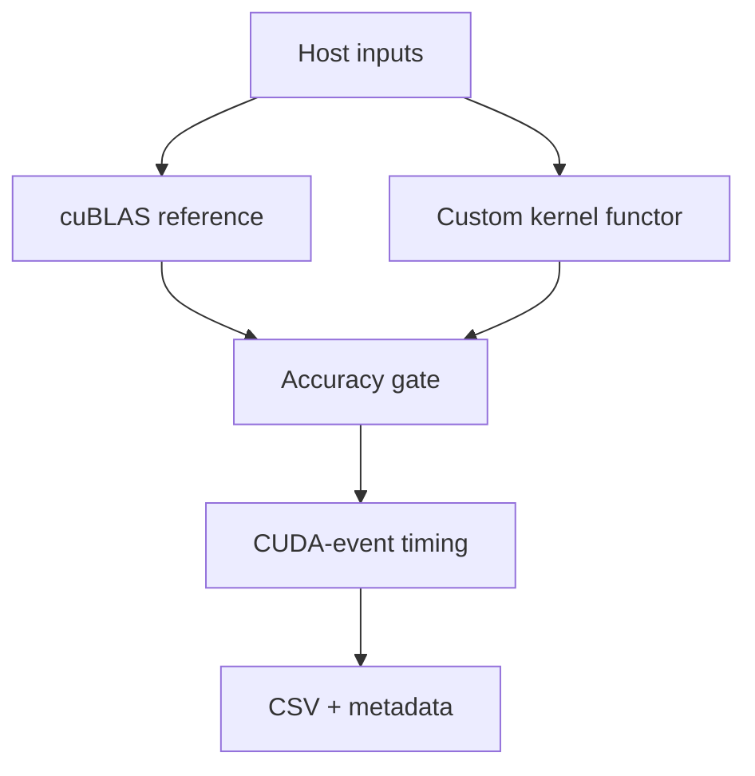

# gemm_y

## Purpose

A CUDA GEMM learning and benchmarking harness. The goal is to understand and
measure custom kernels against cuBLAS, with BF16 first on Hopper (`sm_90`), then
other data types and architectures.



## Current scope

- `C = A × B`, column-major, square benchmark sizes.
- BF16, FP16, and TF32 storage with FP32 accumulation; BF16 is the active path.
- One target architecture per build: `sm_90`, `sm_100`, or `sm_120`.
- cuBLAS v2 (`cublasGemmEx`) is the reference.
- No transpose, batched/grouped GEMM, multi-GPU execution, fused epilogues,
  FP8, INT8, or pedantic FP32 GEMM.

## Build and test

Requirements: CUDA Toolkit >= 12.8, CMake >= 3.21, C++/CUDA 17.

```sh
# Default: sm_120
cmake -S . -B build
cmake --build build --target kernel_smoke -j
./build/kernel_smoke
cmake --build build -j
ctest --test-dir build --output-on-failure

# Hopper
cmake -S . -B build_sm90 -DGEMM_Y_CUDA_ARCH=sm_90
cmake --build build_sm90 --target kernel_smoke -j
./build_sm90/kernel_smoke
```

`kernel_smoke` is the first correctness gate. It checks boundary-sensitive
padded leading dimensions and compares custom output with cuBLAS. Run it before
benchmarking. The full benchmark writes `results/bench_<arch>_<dtype>.csv` and
`.meta`; direct runs are for quick checks only.

For reproducible local timing, use the clock-locking wrapper as root:

```sh
sudo scripts/bench.sh [./build/gemm_y]
python scripts/ingest.py results/bench_sm_90_bf16.csv --label "sm90 bf16"
```

Do not run `sudo` from an agent; the user runs that command. Remote validation is
manual and uses `./rtest pack upload run-smoke fetch` (then `run-bench fetch`).
Edit its connection settings before use and do not commit credentials or
remote artifacts.

## Repository map

- `src/main.cpp`: benchmark entry point and explicit kernel registry.
- `src/bench/`: profiler, timing, accuracy, statistics, and CSV support.
- `src/cublas/`: cuBLAS reference adapter.
- `src/sm90/`, `src/sm100/`, `src/sm120/`: architecture-specific kernels.
- `tests/test.cu`: general CUDA/unit tests; `tests/kernel_smoke.cu`: focused
  kernel validation.
- `scripts/`: clock locking, ingestion, database, and dashboard tools.

CMake compiles only the selected `src/sm*` directory. New `.cu` files there are
discovered automatically; declarations belong in the matching `.cuh` header.

## Kernel contract

Each custom kernel is an independently identifiable stateless functor:

```cpp
static constexpr std::string_view name();
static constexpr std::string_view description();
void operator()(GemmArgs<T>, cudaStream_t) const;
```

The device `__global__` function must use raw pointers and dimensions, not
harness types:

```text
(const T* A, const T* B, T* C,
 int M, int N, int K, int ldA, int ldB, int ldC)
```

Use column-major addressing (`A[i+k*ldA]`, `B[k+j*ldB]`, `C[i+j*ldC]`), fully
overwrite logical `C`, support arbitrary valid leading dimensions, and guard
partial tiles. Check launch errors for new or materially changed kernels.

## Engineering rules

- Keep architecture-specific CUDA in its own directory; avoid architecture
  `#ifdef` branches in kernel implementations.
- Include CUDA APIs through `src/cuda_compat.h`; check runtime and cuBLAS calls.
- Use RAII for CUDA resources and CUDA events for device timing.
- Keep benchmark registration explicit and reproducible.
- Accuracy gates: BF16 `1e-2`, FP16 `1e-3`, TF32 `1e-3` relative error.
- Change one kernel variable at a time; retain failed/slower candidates and
  their results for learning.
- Tuning candidates belong in temporary profiling targets, not `src/main.cpp`.
  Production dispatch must be deterministic and free of I/O, allocation,
  synchronization-for-measurement, or runtime string lookup.
- Do not commit build directories, benchmark results, profiler reports,
  environments, remote artifacts, or generated CMake files. Do not commit or
  create branches unless explicitly requested.

## Known follow-ups

- Replace live connection values in `rtest` with environment/CLI configuration;
  keep destructive remote replacement explicitly confirmed.
- Add optimized Hopper BF16 kernels and explicit smoke/regression coverage as
  each candidate lands.
- Optimize FP16 and TF32 only after the BF16 Hopper path is understood.
