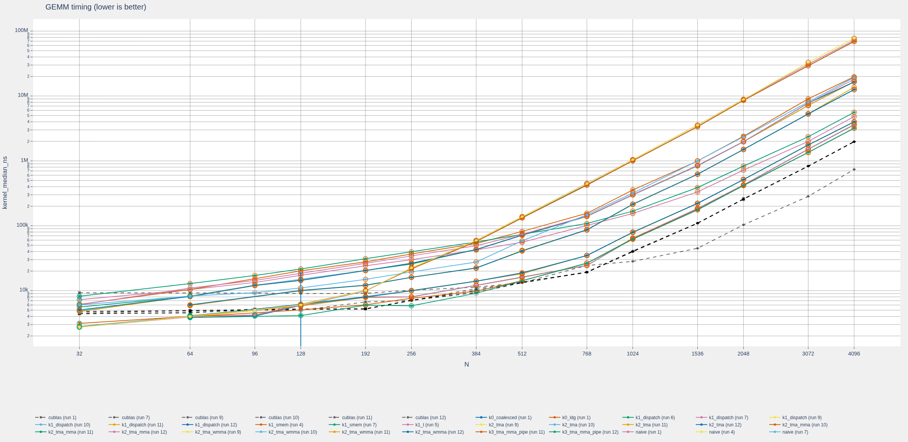
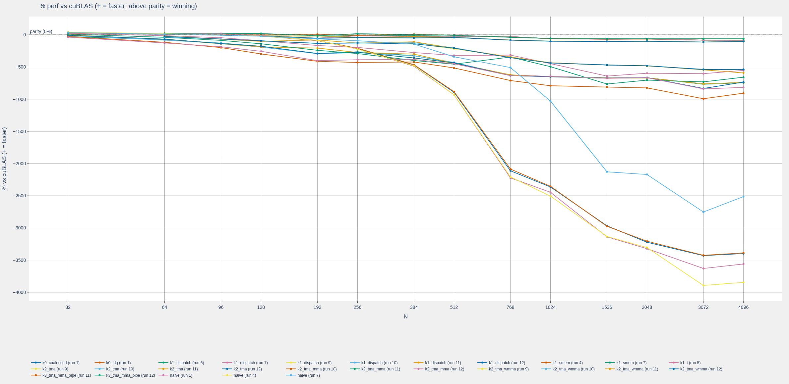

# gemm_y

CUDA GEMM learning and benchmarking harness. It compares architecture-specific
kernels with cuBLAS using BF16, FP16, and TF32 storage with FP32 accumulation.
The active development path is BF16 on Hopper (`sm_90`).

## Results at a glance

The dashboard stores benchmark runs in SQLite and plots timing and performance
relative to cuBLAS. Lower timing is better; positive performance percentage is
faster than cuBLAS.





## Requirements

- CUDA Toolkit >= 12.8
- CMake >= 3.21
- C++/CUDA 17
- NVIDIA GPU matching the selected build architecture

## Build and test with CMake

Configure one architecture per build. The default is `sm_120`:

```sh
cmake -S . -B build
cmake --build build -j
ctest --test-dir build --output-on-failure
```

For Hopper:

```sh
cmake -S . -B build_sm90 -DGEMM_Y_CUDA_ARCH=sm_90
cmake --build build_sm90 --target kernel_smoke -j
./build_sm90/kernel_smoke
cmake --build build_sm90 --target gemm_y -j
./build_sm90/gemm_y
```

`kernel_smoke` is the focused correctness gate. Run it before collecting
benchmark results.

## Docker

Build the CUDA development image and mount the checkout into the container:

```sh
docker build -t gemm-y:cuda128 .
docker run --rm -it --gpus all \
  -v "$(pwd):/workspace/gemm_y" \
  gemm-y:cuda128
```

Inside the container, use the CMake commands above. The image is based on a
CUDA 12.8 PyTorch development image and starts in `/workspace/gemm_y`.

## Dashboard and Python tools

Create a virtual environment and install the dashboard dependencies:

```sh
python3 -m venv .venv
. .venv/bin/activate
python -m pip install -r scripts/requirements.txt
```

After a benchmark creates a CSV and `.meta` sidecar, ingest it into the SQLite
database and start the dashboard:

```sh
python scripts/ingest.py results/bench_sm_90_bf16.csv --label "sm90 bf16"
python scripts/server.py --port 8050
```

Open <http://localhost:8050>. Restart the server after ingesting new runs.

For reproducible local timing where supported:

```sh
sudo scripts/bench.sh ./build_sm90/gemm_y
```

## Quick remote testing with `rtest`

Use `rtest` to pack the minimal source tree, upload it, and run the focused
smoke test remotely without waiting for a full benchmark:

```sh
# Create .rtest.conf first; it is local-only and ignored by Git.
./rtest pack upload run-smoke fetch
```

Example `.rtest.conf`:

```bash
REMOTE_HOST="your-remote-host"
REMOTE_PORT="11480"
REMOTE_USE="root"
SSH_KEY="${HOME}/.ssh/id_ed25519"
REMOTE_ARCH="sm_90"
```

The remote workflow configures and builds only `kernel_smoke`, then fetches
logs into `artifacts/rtest/remote/`. Run the full remote benchmark only after
smoke passes:

```sh
./rtest run-bench
./rtest fetch
```

Do not commit `.rtest.conf`, build directories, benchmark results, or remote
artifacts.
